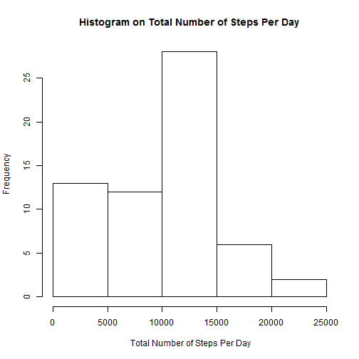
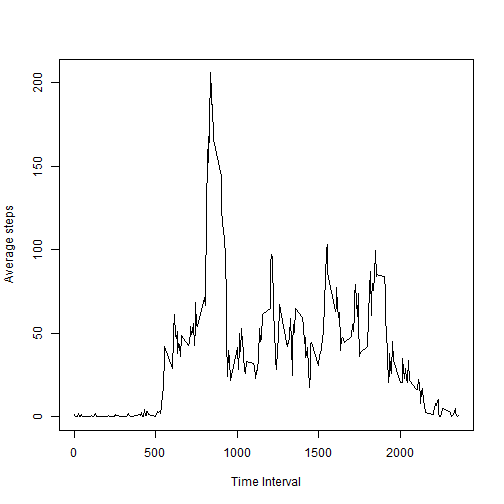
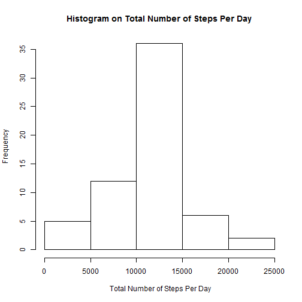
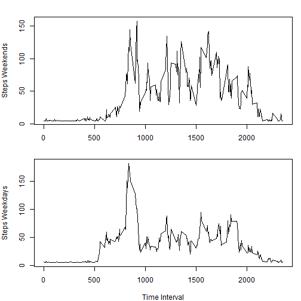

##This file has answers for the assignment 1 questions.

The first step is loading the data


```r
setwd("~//Reproducible Research//week 2")
MovementData<- read.csv("activity.csv")
```

##The first question is about steps taken per day.
The first step for this is to aggregare the data.
The following line calculate are used to the total numbers of steps taken per day, for each day.


```r
attach(MovementData)
```

```
## The following objects are masked from Weekdaydata:
## 
##     date, interval, steps
```

```r
StepsbyDay <-aggregate(steps, by=list(date), 
                    FUN=sum, na.rm=TRUE)
detach(MovementData)
library(plyr)
StepsbyDay <- rename(StepsbyDay, c("Group.1" = "Date","x" = "TotalSteps" ))
```

The next step is the make the histogram.
And find mean and median numbers of steps per day.

```r
hist(StepsbyDay$TotalSteps, xlab = " Total Number of Steps Per Day", 
     main = "Histogram on Total Number of Steps Per Day")
```

 

```r
mean(StepsbyDay$TotalSteps)
```

```
## [1] 9354.23
```

```r
median(StepsbyDay$TotalSteps)
```

```
## [1] 10395
```

##Next is to find the average daily activity pattern.

In order to find average number of steps for each days I added a column showing days.
Then I also extracted the data ommiting any row with NA.


```r
MovementData$day <- weekdays(as.Date(MovementData$date))
Completecases <- na.omit(MovementData)
```

Aggregate the steps for each time interval for each day.
The output of the following lines of code 
is the table with average steps for each time period.


```r
attach(Completecases)
```

```
## The following objects are masked from Weekdaydata:
## 
##     date, day, interval, steps
```

```r
        StepsbyWeekDay <-aggregate(steps, by=list(day,interval), FUN=mean, na.rm=T)
detach(Completecases)
StepsbyWeekDay<- StepsbyWeekDay[c(-1)]

attach(StepsbyWeekDay)
```

```
## The following object is masked _by_ .GlobalEnv:
## 
##     x
```

```r
StepsbyWeekDay2 <-aggregate(StepsbyWeekDay, by=list(Group.2),FUN=mean, na.rm= T)
detach(StepsbyWeekDay)
```

Then plot the timeseries with time interval in x axis, 
and average steps in y axis.


```r
plot(StepsbyWeekDay2$Group.2, StepsbyWeekDay2$x, type="l", pch=1, xlab= "Time Interval",ylab = "Average steps")
```

 

The time when people take maximum steps is shown below.
This is given by Time_interval_Max_step

```r
max_step<- max(StepsbyWeekDay2$x)
max_step
```

```
## [1] 205.9612
```

```r
Time_interval_Max_step <- StepsbyWeekDay2[which(StepsbyWeekDay2$x==max_step), 2]
Time_interval_Max_step
```

```
## [1] 835
```


##Imputing the missing values

Total number of missing values in the dataset.
Value of steps are missing. The total number is calculated as following;

```r
sum(is.na(MovementData$steps))
```

```
## [1] 2304
```

The missing values are imputed by the mean.
And a new dataset which is equal to the old one but without
any missing data is created.
This is done as following:

```r
x<-mean(MovementData$steps, na.rm=T)
MovementData1<- MovementData
MovementData1$steps[is.na(MovementData$steps)] <- x
```

Then the histogram is made as in the first question.
In order to make histogram number of steps are summed by date.


```r
attach(MovementData1)
```

```
## The following objects are masked from Weekdaydata:
## 
##     date, day, interval, steps
```

```r
StepsbyDay1 <-aggregate(steps, by=list(date), 
                       FUN=sum)
detach(MovementData1)

library(plyr)
StepsbyDay1 <- rename(StepsbyDay1, c("Group.1" = "Date","x" = "TotalSteps" ))

hist(StepsbyDay1$TotalSteps, xlab = " Total Number of Steps Per Day", 
     main = "Histogram on Total Number of Steps Per Day")
```

 

Then mean and median of daily steps are calculated
 Here mean and median have slightly gone up compared to when na were remove.
 Since same number (mean) is imputed in place of NA (which was 2304), the data has become more symetric as well.

```r
mean(StepsbyDay1$TotalSteps)
```

```
## [1] 10766.19
```

```r
median(StepsbyDay1$TotalSteps)
```

```
## [1] 10766.19
```

##Steps taken during weekdays and weekends


 It uses the imputed dataset.
 This is first broken down into weekdays and weekend
 

```r
Weekenddata <- subset(MovementData1, day == "Sunday" | day == "Saturday" ) 
Weekdaydata <- subset(MovementData1, day != "Sunday" | day != "Saturday" ) 
```
 
### Aggregating weekend andd weekday data by number of steps and days
The following codes agreegate the average steps for each 5 minutes time interval. It is similar to what is done in the begining, but here weekdays and weekends are seperated. 

This first group of codes are for the weekends.
 

```r
attach(Weekenddata)
```

```
## The following objects are masked from Weekdaydata:
## 
##     date, day, interval, steps
```

```r
StepsbyDayweekend <-aggregate(steps, by=list(day,interval), FUN=mean)
StepsbyDayweekend<-StepsbyDayweekend[c(-1)]
detach(Weekenddata)

attach(StepsbyDayweekend)
```

```
## The following object is masked _by_ .GlobalEnv:
## 
##     x
```

```r
StepsbyDayweekend2 <-aggregate(StepsbyDayweekend, by=list(Group.2), 
                            FUN=mean, na.rm=TRUE)
detach(StepsbyDayweekend)
```
This is exactly the samething for weekdays.


```r
attach(Weekdaydata)
```

```
## The following objects are masked from Weekdaydata (pos = 4):
## 
##     date, day, interval, steps
```

```r
StepsbyDayweekday <-aggregate(steps, by=list(day,interval), FUN=mean)
StepsbyDayweekday<-StepsbyDayweekday[c(-1)]
detach(Weekdaydata)

attach(StepsbyDayweekday)
```

```
## The following object is masked _by_ .GlobalEnv:
## 
##     x
```

```r
StepsbyDayweekday2 <-aggregate(StepsbyDayweekday, by=list(Group.2), 
                               FUN=mean, na.rm=TRUE)
detach(StepsbyDayweekday)
```
 
 Plotting time interval in x axis and average steps in y axis.
 There are two plots one for weekdays and one for weekends.
 

```r
par(mfrow = c(2, 1), mar = c(4, 4, 0, 1), oma = c(0, 0, 2, 0))
         {
        plot(StepsbyDayweekend2$Group.2, StepsbyDayweekend2$x, type="l", pch=1, xlab= "", ylab= 'Steps Weekends')
        plot(StepsbyDayweekday2$Group.2, StepsbyDayweekday2$x, type="l", pch=1, xlab= "Time Interval", ylab='Steps Weekdays')
}
```

 
 
 
One weekends people wakeup late, so there are fewer steps in early morning.
They also seem not to take steps at late night also.

